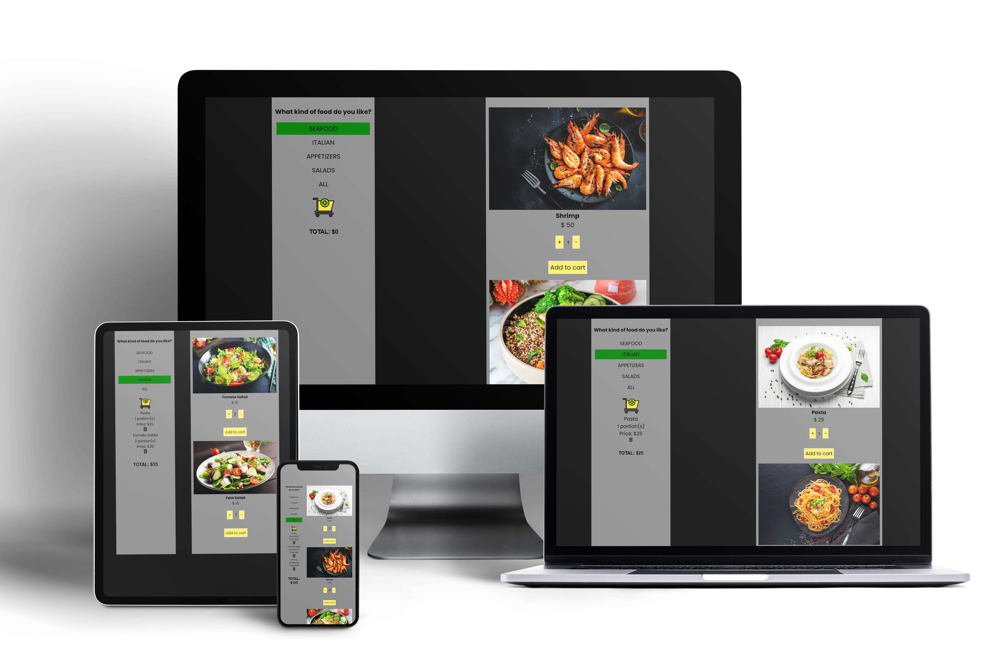

# Redux "Add-To-Cart" App



View Demo <a href="https://react-redux-add-cart.netlify.app/" target="_blank">Redux "Add-To-Cart" App</a>

## 🦉 Main information

Add-to-cart functionality is essential to every e-commerce site, allowing visitors to select, reserve, and purchase a product or service.

Here shows the add-to-cart functionality using the example of ordering dishes in a restaurant.

The client can choose a dish and its quantity and order a dish by adding it to the cart. And the price changes automatically.

Built with React Redux and Redux Toolkit.

## 🦊 Useful links to study

- Getting Started with Redux https://redux.js.org/introduction/getting-started

- Getting Started with Redux Toolkit https://redux-toolkit.js.org/introduction/getting-started

- How JavaScript’s Reduce method works https://medium.com/free-code-camp/reduce-f47a7da511a9

- Javascript Reduce function https://medium.com/@sabih811/javascript-reduce-function-3189cc685201

- React Lists and Keys https://reactjs.org/docs/lists-and-keys.html

- Index as a key https://robinpokorny.com/blog/index-as-a-key-is-an-anti-pattern/

## ⏲️ Run project

In the project directory, you can run:

### `npm start`

Runs the app in the development mode.\
Open [http://localhost:3000](http://localhost:3000) to view it in your browser.

The page will reload when you make changes.\
You may also see any lint errors in the console.

## ⚡ Setup

This project was bootstrapped with [Create React App](https://github.com/facebook/create-react-app). 

The following technologies and components were used in this project:

### Install Create React app

```
npx create-react-app my-app
cd my-app
npm start
```

### Install React Redux

```
npm install react react-redux
```

### Install Redux Toolkit

```
npm install @reduxjs/toolkit 
```

